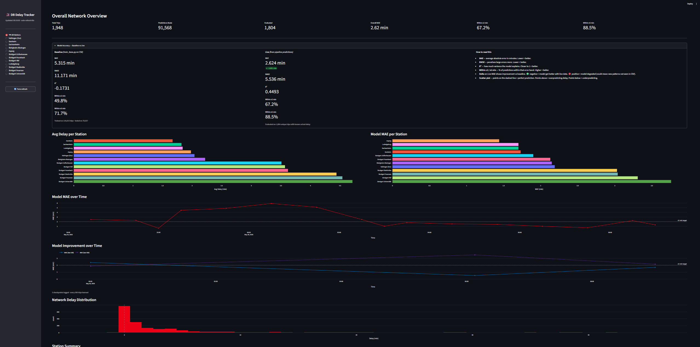
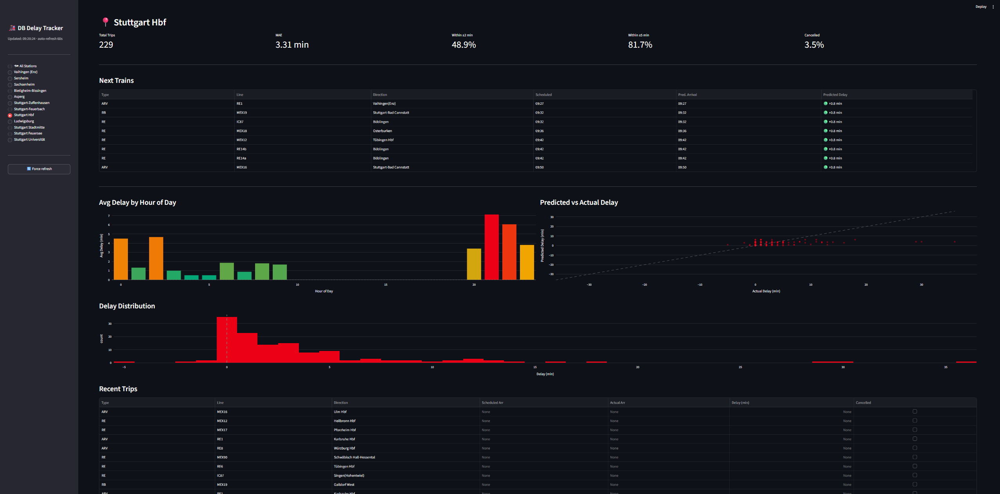

# DB Delay Tracker

A real-time Deutsche Bahn train delay prediction system using online machine learning. Scrapes live data from the DB Timetables API every 60 seconds, predicts arrival delays for 12 stations in the Stuttgart S-Bahn network, and displays everything on a live Streamlit dashboard.

## Screenshots

> Add screenshots of your dashboard to `docs/screenshots/` and reference them here.

| Overall Network View | Station Detail |
|---|---|
|  |  |

## Notebooks

Step-by-step explanations — open with nbviewer if GitHub preview fails:

| Notebook | nbviewer |
|---|---|
| 01 — Data & the DB API | [](https://nbviewer.org/github/Murpppp/db-delay-tracker/blob/main/notebooks/01_data_and_api.ipynb) |
| 02 — Feature Engineering | [](https://nbviewer.org/github/Murpppp/db-delay-tracker/blob/main/notebooks/02_feature_engineering.ipynb) |
| 03 — Model Training & Eval | [](https://nbviewer.org/github/Murpppp/db-delay-tracker/blob/main/notebooks/03_model_training_and_eval.ipynb) |

## Architecture

```
DB Timetables API  (plan + fchg endpoints)
        │
        ▼
   scraper.py       fetch XML for 12 stations every 60s
        │
        ▼
  pipeline.py       extract features → predict → learn → store
        │
   ┌────┴────┐
   ▼         ▼
PostgreSQL   model.pkl     (HoeffdingAdaptiveTreeRegressor)
   │
   ▼
dashboard.py         Streamlit live dashboard (auto-refresh 60s)
```

## Tech Stack

| Layer | Technology |
|---|---|
| Online ML | [River](https://riverml.xyz/) — `HoeffdingAdaptiveTreeRegressor` |
| Database | PostgreSQL + psycopg2 |
| Dashboard | Streamlit + Plotly |
| Data source | Deutsche Bahn Timetables API v1 |
| Language | Python 3.10+ |

## Features (29 total)

The model uses 29 features across 5 groups:

- **Time** — hour, weekday, minutes since midnight
- **Cyclical encodings** — sin/cos for hour, minute, weekday, week, month (avoids discontinuities at midnight/Monday/January)
- **Real-time signal** — departure delay at current station (`dep_delay_min`, `dep_delay_known`)
- **Route topology** — route length, position in route (0–1), route identity hash (from `ppth`)
- **Upstream propagation** — last confirmed delay for this train at any prior station (`upstream_delay_min`)

## Model

Uses River's `HoeffdingAdaptiveTreeRegressor` — an online decision tree that:
- Updates with every confirmed arrival (`learn_one`)
- Never requires retraining from scratch
- Adapts to concept drift (seasonal patterns, timetable changes) over time
- Saves a checkpoint (`model.pkl`) every 500 learned trips

## Results (after ~1 week of live learning)

| Metric | Baseline (CSV) | Live |
|---|---|---|
| MAE | ~5.4 min | ~2.5 min |
| Within ±5 min | ~72% | ~88% |
| R² | negative | ~0.4+ |

## Setup

> **Important:** There is no pre-trained model included in this repo (`model.pkl` is gitignored).
> You need to set everything up yourself — API key, database, and an initial training run.
> The good news: once the pipeline is running, the model trains itself automatically from live data.

### 1. Prerequisites

**Python 3.10+**

**PostgreSQL** — you need a running PostgreSQL instance. Install it from [postgresql.org](https://www.postgresql.org/download/) or use Docker:
```bash
docker run --name db-delays -e POSTGRES_PASSWORD=yourpassword -p 5432:5432 -d postgres
```

**Deutsche Bahn Timetables API key** — register for free at [developers.deutschebahn.com](https://developers.deutschebahn.com), create an application, and subscribe to the **Timetables v1** API. You will get a `Client ID` and an `API Key`.

### 2. Installation

```bash
git clone https://github.com/your-username/db-delay-tracker
cd db-delay-tracker
pip install -r requirements.txt
```

### 3. Configuration

Copy the example env file and fill in your credentials:

```bash
cp .env.example .env
```

Edit `.env`:
```
DB_CLIENT_ID=your_client_id_from_db_portal
DB_API_KEY=your_api_key_from_db_portal

DB_HOST=localhost
DB_PORT=5432
DB_NAME=db_delays
DB_USER=postgres
DB_PASS=yourpassword
```

### 4. Create the PostgreSQL database

Connect to PostgreSQL and create the database:

```sql
CREATE DATABASE db_delays;
```

The tables (`trips` and `predictions`) are created **automatically** the first time `pipeline.py` runs — you don't need to create them manually.

### 5. Warm-up training (optional but recommended)

The model starts completely untrained. Without a warm-up, its first predictions will be close to zero for everything — it needs to accumulate data before it becomes useful.

**Option A — Skip warm-up (cold start):**
Just go straight to step 6. The pipeline will create a fresh model and start learning from scratch. Predictions will be poor for the first few hours but improve automatically.

**Option B — Warm-up from a historical CSV:**
If you have a CSV export of historical trips (e.g. from a previous run), you can pre-train the model on it:

```bash
python train_base.py
```

This expects a file called `trips_final.csv` in the project root with columns matching the `trips` table schema. It trains on all rows except the last 3 days (held out for evaluation) and saves `model.pkl` and `model_eval.json`.

After a few days of live data you can export from PostgreSQL and retrain:

```sql
COPY (SELECT * FROM trips ORDER BY scheduled_arr)
TO '/absolute/path/to/trips_final.csv' CSV HEADER;
```

Then re-run `train_base.py`. Each retrain will significantly improve accuracy because the model now sees real route topology and upstream delay patterns from day one.

### 6. Start the live pipeline

```bash
python pipeline.py
```

This runs forever (Ctrl+C to stop). Every 60 seconds it:
- Fetches live data from the DB API for all 12 stations
- Makes delay predictions
- Stores everything in PostgreSQL
- Learns from any confirmed arrivals
- Saves `model.pkl` every 500 learned trips

### 7. Launch the dashboard

In a separate terminal:

```bash
streamlit run dashboard.py
```

Open [http://localhost:8501](http://localhost:8501) in your browser.

## Project Structure

```
db-delay-tracker/
├── scraper.py          DB API fetching + station list
├── preprocessing.py    Feature engineering (shared by pipeline + train_base)
├── pipeline.py         Live scraping loop + online learning
├── train_base.py       One-time base training from CSV
├── dashboard.py        Streamlit dashboard
├── requirements.txt
├── .env.example
└── notebooks/
    ├── 01_data_and_api.ipynb         How the DB API works
    ├── 02_feature_engineering.ipynb  Why each feature was chosen
    └── 03_model_training_and_eval.ipynb  Training + interpreting results
```

## Stations Tracked

All in the Stuttgart / Vaihingen–Stuttgart S-Bahn corridor:

Vaihingen (Enz) · Sersheim · Sachsenheim · Bietigheim-Bissingen · Asperg ·
Stuttgart-Zuffenhausen · Stuttgart-Feuerbach · Stuttgart Hbf · Ludwigsburg ·
Stuttgart Stadtmitte · Stuttgart Feuersee · Stuttgart Universität

## Notes

- IC/ICE trains are excluded (different delay patterns, separate network)
- The predictions table keeps all raw predictions (one per scrape cycle per trip); the dashboard deduplicates with `DISTINCT ON` for accurate metrics
- `learned_keys` prevents the same trip arrival from being learned twice across cycles
